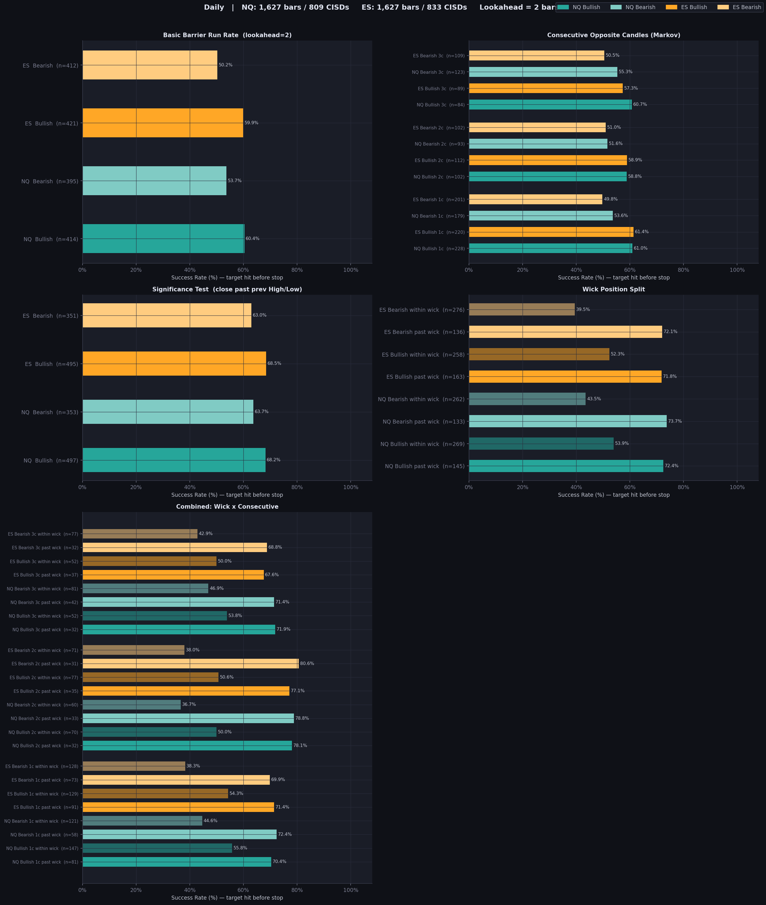
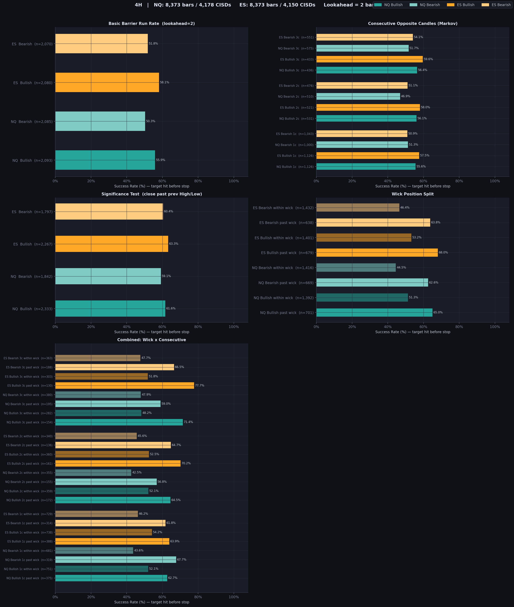
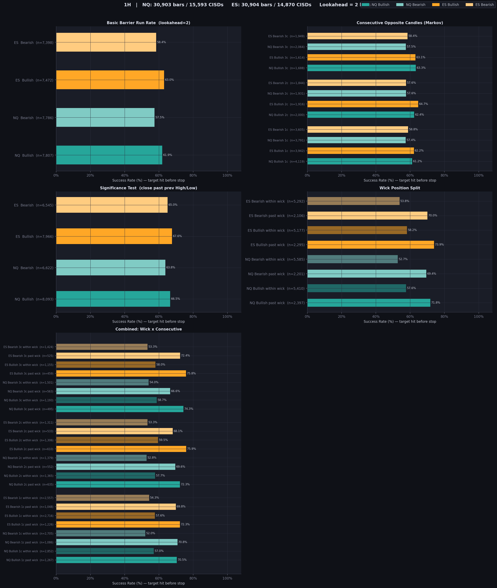
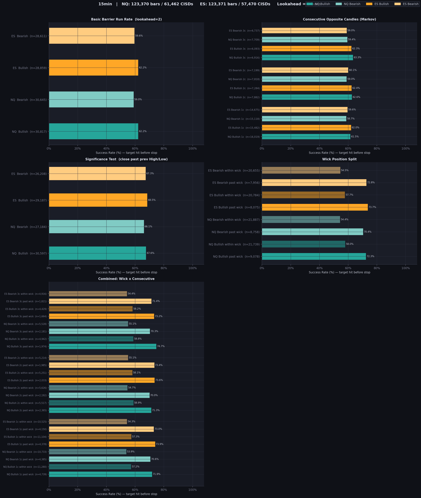
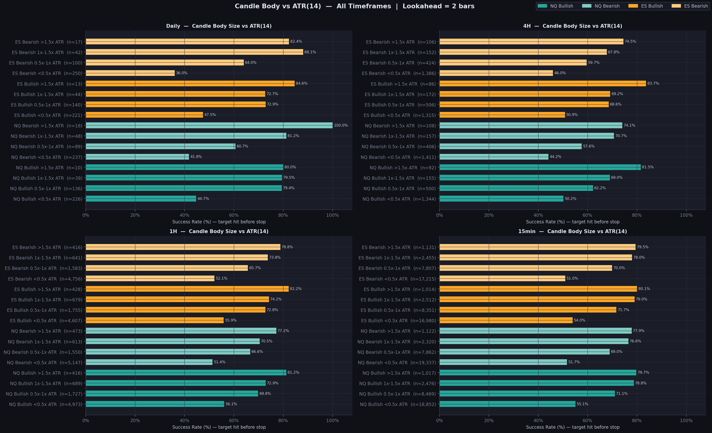
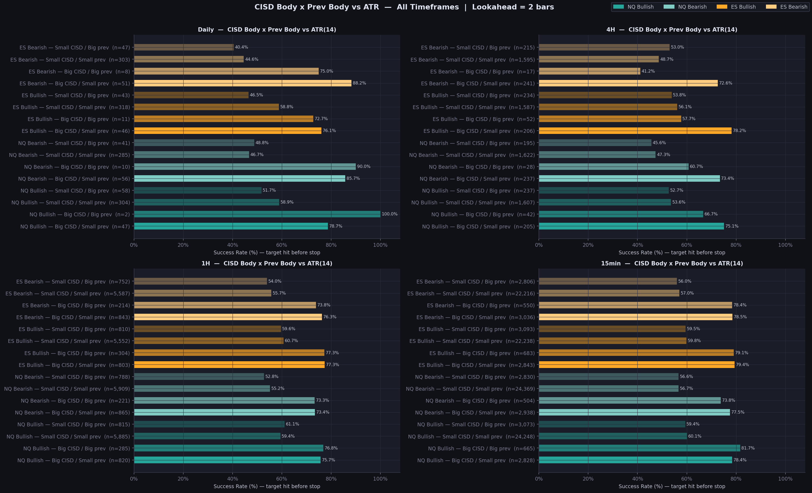
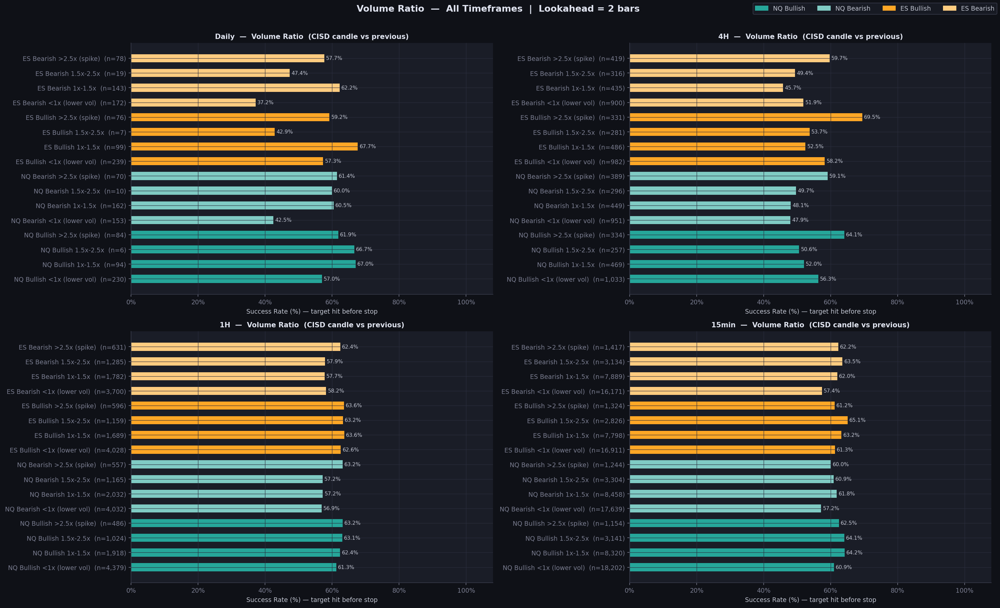

# CISD Barrier Analysis Suite

A high-performance analysis engine for testing **CISD (Close Implies Subsequent Direction)** patterns across NQ and ES.

This tool evaluates the "run rate" of the CISD pattern using a strict **Barrier Problem** approach: *Does the price hit the target (CISD High/Low) before hitting the stop (opposite side) within the lookahead window?*

## Key Findings

> All figures use barrier logic: target hit **before** stop, lookahead = 2 bars.

### 1. Baseline (Basic Run Rate)

| Timeframe | NQ Bull | NQ Bear | ES Bull | ES Bear |
|---|---|---|---|---|
| Daily | 60.4% | 53.7% | 59.9% | 50.2% |
| 4H | 55.9% | 50.3% | 58.1% | 51.8% |
| 1H | 61.9% | 57.5% | 63.0% | 58.4% |
| 15min | 62.2% | 59.0% | 62.2% | 59.6% |

**4H is the weakest timeframe.** 1H and 15min are the most consistent. Bullish bias is persistent across all timeframes (~4–10%).

---

### 2. Wick Position (Strongest Edge)

A CISD that closes **past the previous wick** is the single most reliable filter.

| Timeframe | Past Wick (avg) | Within Wick (avg) | Spread |
|---|---|---|---|
| Daily | ~72–73% | ~44–54% | **~20–29pp** |
| 4H | ~63–68% | ~44–53% | **~15–20pp** |
| 1H | ~70–74% | ~53–58% | **~15–18pp** |
| 15min | ~71–74% | ~54–58% | **~15–19pp** |

*Within-wick bearish setups on the Daily are particularly weak: ES bearish within-wick hits only **39.5%** — worse than random.*

---

### 3. Combined Wick × Consecutive Candles

Combining past-wick closure with 2–3 consecutive opposite candles consistently yields the highest hit rates:

| Timeframe | Best bucket | Rate |
|---|---|---|
| Daily | NQ Bear 2c past wick | **78.8%** |
| Daily | ES Bear 2c past wick | **80.7%** |
| 4H | ES Bull 3c past wick | **77.7%** |
| 1H | ES Bull 3c past wick | **75.8%** |
| 15min | NQ Bull 3c past wick | **74.7%** |

Within-wick + 2c on Daily (ES bear) drops to **36.7%** — the weakest observed bucket.

---

### 4. Stricter CISD (Significance Test)

Requiring the close to exceed the **previous candle's High/Low** (not just the close) gives a +5–8% lift:

| Timeframe | NQ Bull | NQ Bear | ES Bull | ES Bear |
|---|---|---|---|---|
| Daily | 68.2% | 63.7% | 68.5% | 63.0% |
| 4H | 61.6% | 59.1% | 63.3% | 60.4% |
| 1H | 66.5% | 63.8% | 67.6% | 65.0% |
| 15min | 67.6% | 66.1% | 68.5% | 67.3% |

---

### 5. Consecutive Opposite Candles (Markov)

Consecutive candle count alone has **weak and inconsistent** predictive value. Hit rates are largely flat across 1–3 consecutive opposite candles, staying within ±3% of the baseline. The edge only emerges when combined with wick position (see §3).

---

### 6. Candle Body Size vs ATR & Cross-Tab
*(See standalone charts: `CandleSize_All_Timeframes.png`, `SizeCross_All_Timeframes.png`)*

CISD candles with a body ≥ 1x ATR(14) show meaningfully higher hit rates than smaller candles. The cross-tab reveals:
- **Big CISD + Small prev** = strongest quadrant.
- **Small CISD + Big prev** = weakest quadrant.
- A small previous candle amplifies the advantage of a large CISD body.

---

### 7. Volume Ratio
*(See `Volume_All_Timeframes.png`)*

Volume ratio (CISD candle vs previous candle) has **negligible impact** on outcomes. Hit rates are stable across all volume buckets as long as volume ≥ 1x the prior candle.

---

## Visual Reports

**Per-Timeframe (5 core analyses):**









**Standalone — All Timeframes side-by-side:**








---

## Usage

Ensure data is in `.parquet` format in the `data/` directory (`nq_1m.parquet`, `es_1m.parquet`).

### Run all analyses (4 per-TF PNGs + CSVs + 2 standalone PNGs):
```powershell
python cisd_analysis.py
```

### Run specific models:
```powershell
python cisd_analysis.py basic wick combined
```

### Forward return fan charts (static PNGs, sliced by feature):
```powershell
python cisd_analysis.py fan fan_smt fan_size fan_wick fan_consec
```

### Interactive HTML report (compound filter UI):
```powershell
python cisd_analysis.py export_html
```
Opens `output/forward_returns.html` in any browser — no server needed. Filter rows for Timeframe, SMT, Size × Prev, Wick, and Consec can be combined freely; the fan chart updates to the intersection instantly.

## Evaluation Models (All Barrier-Based)

| Key | Model Name | Description |
| :--- | :--- | :--- |
| `basic` | **Basic Run Rate** | Baseline success rate for all CISD events. |
| `mc` | **Markov Segmentation** | Buckets by consecutive opposite-direction candles preceding the CISD. |
| `significance` | **Stricter CISD** | CISD must close past the previous candle's High (Bullish) or Low (Bearish). |
| `wick` | **Wick Position** | Split by whether the close was past the wick or within it. |
| `combined` | **Wick x Markov** | Cross-tab of wick position and consecutive candle count. |
| `volume` | **Volume Ratio** | Segments by CISD volume relative to previous candle. Standalone all-TF output. |
| `candle_size` | **Candle Body vs ATR** | Segments by CISD body size as a multiple of ATR(14). Standalone all-TF output. |
| `size_cross` | **CISD Body × Prev Body** | Cross-tab: both candles vs ATR(14). Standalone all-TF output. |
| `smt_cisd` | **Swing SMT Confirmation** | Barrier rate split by whether a same-direction Swing SMT co-occurs. Standalone. |

## Forward Return Fan Keys

| Key | Output | Description |
| :--- | :--- | :--- |
| `fan` | `Fan_<TF>.png` + `Fan_All_Timeframes.png` | Unfiltered fan, all events. |
| `fan_smt` | `Fan_Smt_All_Timeframes.png` | Fan sliced by SMT presence. |
| `fan_size` | `Fan_Size_All_Timeframes.png` | Fan sliced by CISD body × prev body vs ATR. |
| `fan_wick` | `Fan_Wick_All_Timeframes.png` | Fan sliced by wick position. |
| `fan_consec` | `Fan_Consec_All_Timeframes.png` | Fan sliced by consecutive opposite candle count. |
| `export_html` | `forward_returns.html` | Interactive compound-filter report (all 180 combinations pre-computed). |

## Configuration

Edit constants at the top of `cisd_analysis.py`:
- `LOOKAHEAD`: Bars to check ahead (Default: `2`).
- `MAX_CONSEC`: Max consecutive candles for Markov (Default: `3`).
- `TIMEFRAMES`: Resampling rules (Default: `Daily`, `4H`, `1H`, `15min`).

## Requirements

- Python 3.10+
- `pandas`, `numpy`, `matplotlib`, `pyarrow`
