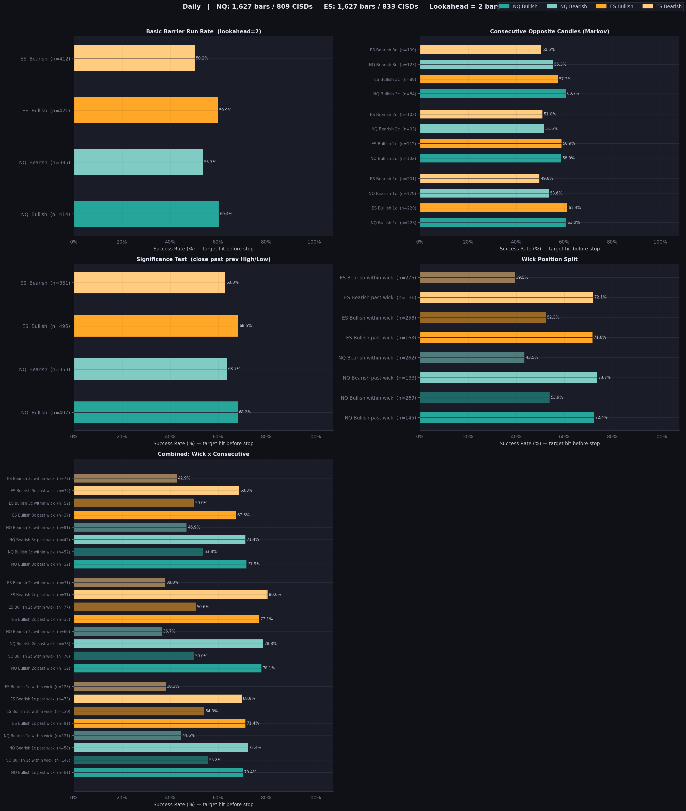
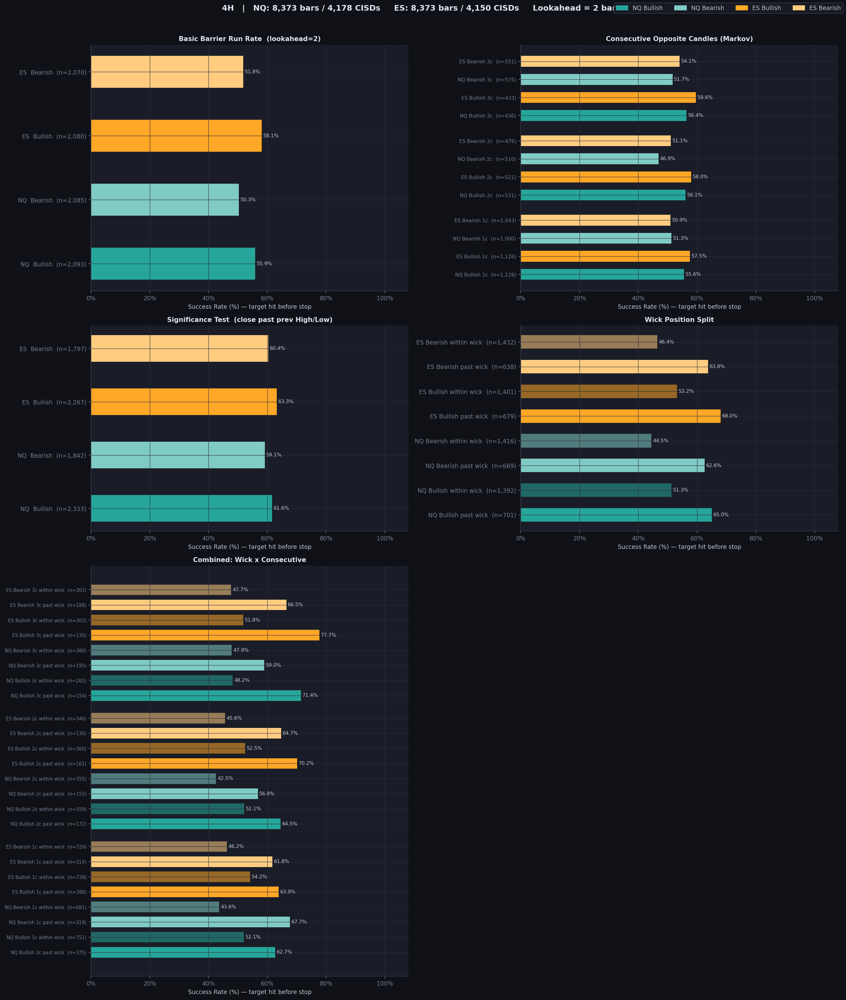
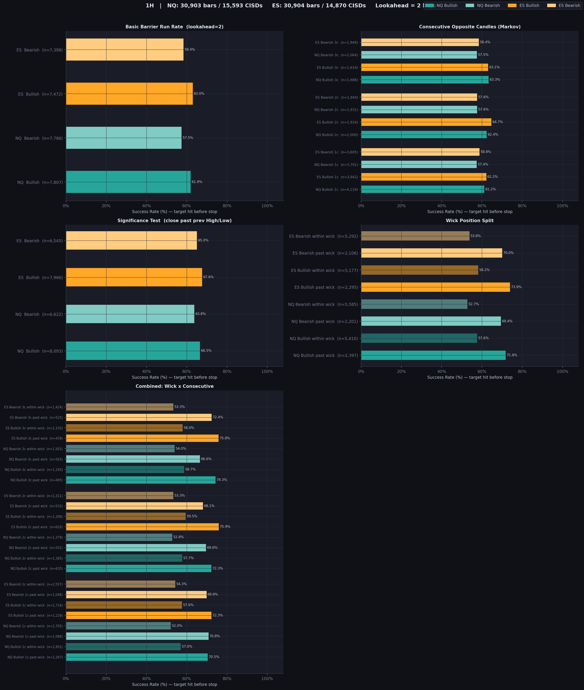
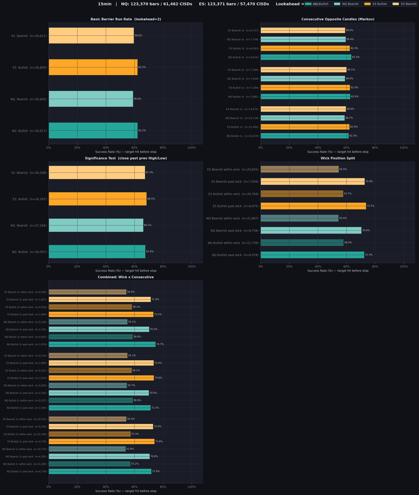
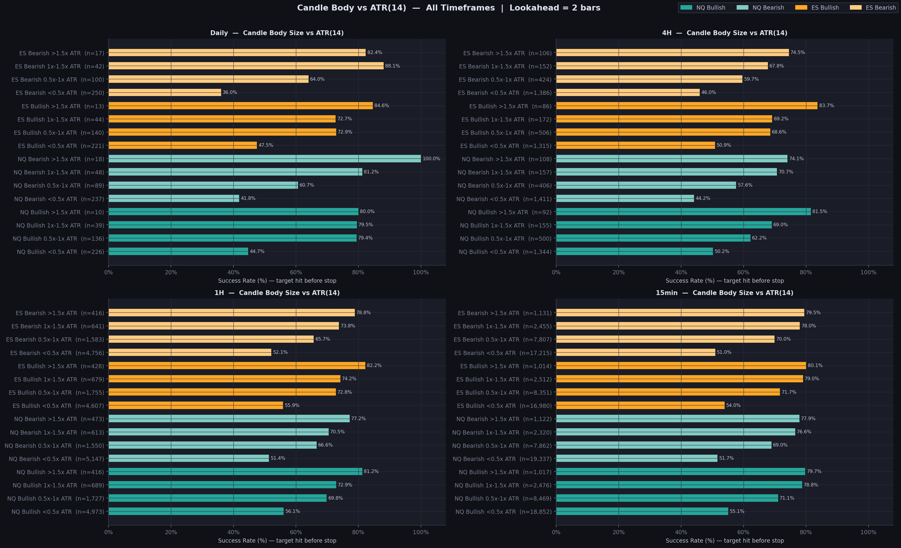
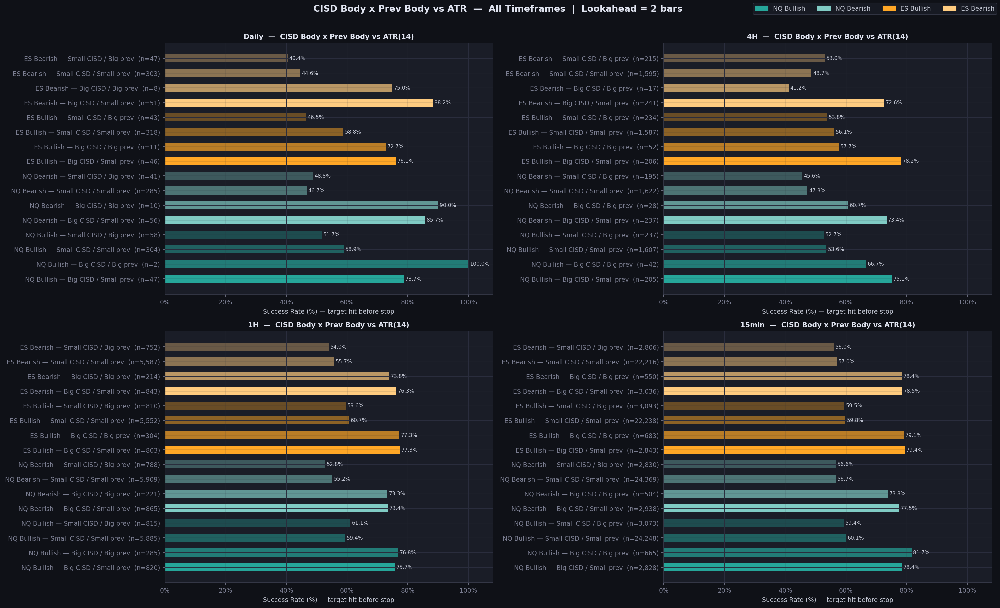
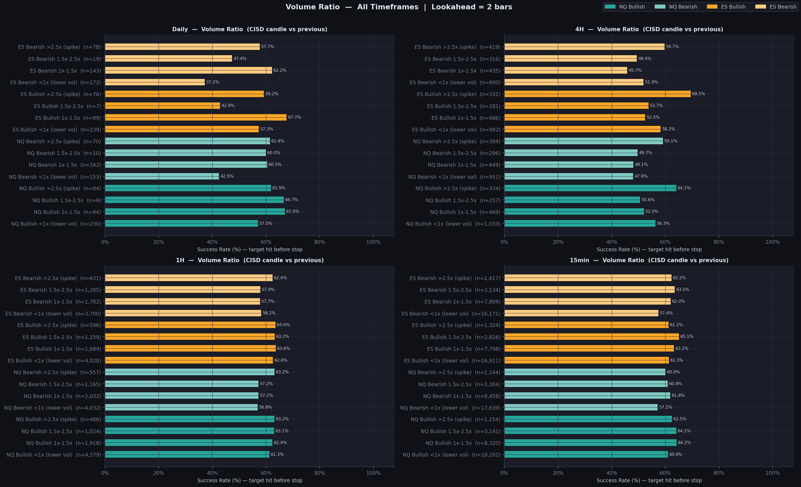
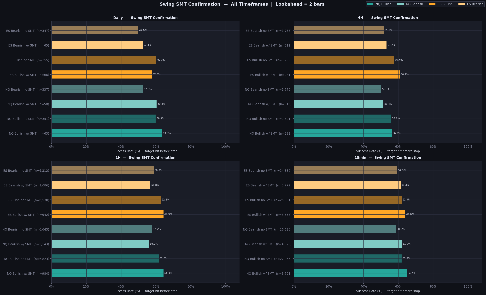

# CISD Barrier Analysis Suite

A high-performance analysis engine for testing **CISD (Close Implies Subsequent Direction)** patterns across NQ and ES.

This tool evaluates the "run rate" of the CISD pattern using a strict **Barrier Problem** approach: *Does the price hit the target (CISD High/Low) before hitting the stop (opposite side) within the lookahead window?*

Swing SMT confirmation is now backed by the local SMT library at `/mnt/e/backup/code/Finance/Misc/SMT`. The matching rule is left-only: a CISD at bar `t` counts when a same-direction Swing SMT was created on `t`, `t-1`, or `t-2`.

Planned future research ideas live in `docs/research_backlog.md`.
The current research surface also includes standalone analyses for CISD-linked FVG creation/hold, sweep confirmation, and direction-specific swing-position buckets.

## Key Findings

> All figures use barrier logic: target hit **before** stop, lookahead = 2 bars.

### How to read these tables

All rates are **discovery-slice rates** (oldest ~70% of data; OOS boundary = `2024-04-30`). Full-history rates are not reported — every number went through the validation harness.

- **N** = discovery sample size
- **95% CI** = Wilson score interval on the discovery slice (pure-Python, no dependencies)
- **✓ CONFIRMED** = eligible (n ≥ 50 on discovery) and the OOS rate held the same side of 50%
- **✗ NOT CONFIRMED** = eligible but the OOS rate did not hold — a retired hypothesis, not a finding
- **below-n / not a finding** = discovery n < 50; shown so the bucket can be watched as n grows

**`below-n` and `✗ NOT CONFIRMED` are different states.** `below-n` means the bucket never had enough data to evaluate — it may be real or may not. `✗ NOT CONFIRMED` means the bucket was fully evaluated and the edge did not replicate out-of-sample; it should not be published as a finding.

---

### 1. Baseline (Basic Run Rate)

| Timeframe | Instrument | Direction | Discovery Rate | N | 95% CI | Verdict |
|---|---|---|---|---|---|---|
| Daily | NQ | Bullish | 61.0% | 292 | [55.3–66.4%] | ✓ CONFIRMED |
| Daily | NQ | Bearish | 59.1% | 279 | [53.3–64.7%] | ✗ NOT CONFIRMED |
| Daily | ES | Bullish | 57.7% | 293 | [52.0–63.2%] | ✓ CONFIRMED |
| Daily | ES | Bearish | 55.3% | 293 | [49.6–60.9%] | ✗ NOT CONFIRMED |
| 4H | NQ | Bullish | 54.9% | 1471 | [52.4–57.5%] | ✓ CONFIRMED |
| 4H | NQ | Bearish | 50.2% | 1465 | [47.7–52.8%] | ✓ CONFIRMED |
| 4H | ES | Bullish | 57.1% | 1463 | [54.5–59.6%] | ✓ CONFIRMED |
| 4H | ES | Bearish | 51.9% | 1458 | [49.3–54.4%] | ✓ CONFIRMED |
| 1H | NQ | Bullish | 61.4% | 5462 | [60.1–62.7%] | ✓ CONFIRMED |
| 1H | NQ | Bearish | 57.3% | 5455 | [56.0–58.6%] | ✓ CONFIRMED |
| 1H | ES | Bullish | 62.7% | 5235 | [61.4–64.0%] | ✓ CONFIRMED |
| 1H | ES | Bearish | 58.5% | 5175 | [57.1–59.8%] | ✓ CONFIRMED |
| 15min | NQ | Bullish | 62.4% | 21518 | [61.7–63.0%] | ✓ CONFIRMED |
| 15min | NQ | Bearish | 59.1% | 21400 | [58.5–59.8%] | ✓ CONFIRMED |
| 15min | ES | Bullish | 62.4% | 20168 | [61.7–63.0%] | ✓ CONFIRMED |
| 15min | ES | Bearish | 59.9% | 20006 | [59.2–60.6%] | ✓ CONFIRMED |

**Key findings:** Bullish bias holds OOS at all timeframes. Bearish Daily failed OOS for both instruments — Daily bearish edges should not be treated as established findings. 4H is the weakest timeframe; 1H and 15min are the most consistent.

---

### 2. Wick Position (Strongest Edge)

A CISD that closes **past the previous wick** is the single most reliable filter.

| Timeframe | Instrument | Direction | Bucket | Discovery Rate | N | 95% CI | Verdict |
|---|---|---|---|---|---|---|---|
| Daily | NQ | Bullish | past_wick | 77.7% | 94 | [68.2–84.9%] | ✓ CONFIRMED |
| Daily | NQ | Bullish | within_wick | 53.0% | 198 | [46.1–59.9%] | ✓ CONFIRMED |
| Daily | NQ | Bearish | past_wick | 75.0% | 100 | [65.7–82.5%] | ✓ CONFIRMED |
| Daily | NQ | Bearish | within_wick | 50.3% | 179 | [43.0–57.5%] | ✗ NOT CONFIRMED |
| Daily | ES | Bullish | past_wick | 70.1% | 107 | [60.8–77.9%] | ✓ CONFIRMED |
| Daily | ES | Bullish | within_wick | 50.5% | 186 | [43.4–57.6%] | ✓ CONFIRMED |
| Daily | ES | Bearish | past_wick | 73.0% | 100 | [63.6–80.7%] | ✓ CONFIRMED |
| Daily | ES | Bearish | within_wick | 46.1% | 193 | [39.2–53.2%] | ✓ CONFIRMED |
| 4H | NQ | Bullish | past_wick | 62.7% | 491 | [58.4–66.9%] | ✓ CONFIRMED |
| 4H | NQ | Bullish | within_wick | 51.0% | 980 | [47.9–54.1%] | ✓ CONFIRMED |
| 4H | NQ | Bearish | past_wick | 61.7% | 488 | [57.3–65.9%] | ✓ CONFIRMED |
| 4H | NQ | Bearish | within_wick | 44.5% | 977 | [41.4–47.7%] | ✓ CONFIRMED |
| 4H | ES | Bullish | past_wick | 67.2% | 466 | [62.8–71.3%] | ✓ CONFIRMED |
| 4H | ES | Bullish | within_wick | 52.4% | 997 | [49.3–55.4%] | ✓ CONFIRMED |
| 4H | ES | Bearish | past_wick | 62.3% | 443 | [57.7–66.7%] | ✓ CONFIRMED |
| 4H | ES | Bearish | within_wick | 47.3% | 1015 | [44.2–50.4%] | ✓ CONFIRMED |
| 1H | NQ | Bullish | past_wick | 71.9% | 1669 | [69.7–74.0%] | ✓ CONFIRMED |
| 1H | NQ | Bullish | within_wick | 56.8% | 3793 | [55.2–58.3%] | ✓ CONFIRMED |
| 1H | NQ | Bearish | past_wick | 68.9% | 1567 | [66.6–71.2%] | ✓ CONFIRMED |
| 1H | NQ | Bearish | within_wick | 52.6% | 3888 | [51.1–54.2%] | ✓ CONFIRMED |
| 1H | ES | Bullish | past_wick | 73.3% | 1602 | [71.1–75.5%] | ✓ CONFIRMED |
| 1H | ES | Bullish | within_wick | 58.1% | 3633 | [56.4–59.6%] | ✓ CONFIRMED |
| 1H | ES | Bearish | past_wick | 69.3% | 1496 | [66.9–71.5%] | ✓ CONFIRMED |
| 1H | ES | Bearish | within_wick | 54.1% | 3679 | [52.5–55.7%] | ✓ CONFIRMED |
| 15min | NQ | Bullish | past_wick | 72.5% | 6281 | [71.4–73.6%] | ✓ CONFIRMED |
| 15min | NQ | Bullish | within_wick | 58.2% | 15237 | [57.4–58.9%] | ✓ CONFIRMED |
| 15min | NQ | Bearish | past_wick | 70.5% | 6114 | [69.4–71.7%] | ✓ CONFIRMED |
| 15min | NQ | Bearish | within_wick | 54.6% | 15286 | [53.8–55.4%] | ✓ CONFIRMED |
| 15min | ES | Bullish | past_wick | 73.9% | 5565 | [72.7–75.0%] | ✓ CONFIRMED |
| 15min | ES | Bullish | within_wick | 58.0% | 14603 | [57.2–58.8%] | ✓ CONFIRMED |
| 15min | ES | Bearish | past_wick | 73.3% | 5570 | [72.2–74.5%] | ✓ CONFIRMED |
| 15min | ES | Bearish | within_wick | 54.7% | 14436 | [53.9–55.5%] | ✓ CONFIRMED |

**Past-wick closure is confirmed across all timeframes and both instruments.** Spread between past-wick and within-wick is ~15–25pp at all timeframes. Daily NQ bearish within-wick (50.3%, n=179) did not survive OOS — within-wick bearish setups on the Daily are not an established finding.

---

### 3. Combined Wick × Consecutive Candles

Combining past-wick closure with 2–3 consecutive opposite candles consistently yields the highest discovery hit rates. Many Daily combined buckets are `below-n / not a finding` due to small sample sizes; the 1H and 15min buckets are the most fully evaluated.

**Daily — selected confirmed and not-confirmed buckets (many Daily cells are below-n):**

| Timeframe | Instrument | Direction | Bucket | Discovery Rate | N | 95% CI | Verdict |
|---|---|---|---|---|---|---|---|
| Daily | NQ | Bullish | 1c_within_wick | 54.1% | 111 | [44.8–63.0%] | ✓ CONFIRMED |
| Daily | NQ | Bearish | 1c_within_wick | 51.2% | 84 | [40.7–61.6%] | ✗ NOT CONFIRMED |
| Daily | NQ | Bearish | 3c_within_wick | 54.5% | 55 | [41.5–66.9%] | ✗ NOT CONFIRMED |
| Daily | ES | Bullish | 1c_past_wick | 72.7% | 55 | [59.8–82.7%] | ✓ CONFIRMED |
| Daily | ES | Bullish | 1c_within_wick | 48.9% | 90 | [38.8–59.0%] | ✗ NOT CONFIRMED |
| Daily | ES | Bullish | 2c_within_wick | 54.4% | 57 | [41.6–66.6%] | ✗ NOT CONFIRMED |
| Daily | ES | Bearish | 1c_past_wick | 71.4% | 56 | [58.5–81.6%] | ✓ CONFIRMED |
| Daily | ES | Bearish | 1c_within_wick | 43.3% | 90 | [33.6–53.6%] | ✓ CONFIRMED |
| Daily | ES | Bearish | 3c_within_wick | 50.0% | 54 | [37.1–62.9%] | ✓ CONFIRMED |

**4H — all buckets:**

| Instrument | Direction | Bucket | Discovery Rate | N | 95% CI | Verdict |
|---|---|---|---|---|---|---|
| NQ | Bullish | 1c_past_wick | 60.9% | 261 | [54.9–66.6%] | ✓ CONFIRMED |
| NQ | Bullish | 1c_within_wick | 52.6% | 532 | [48.4–56.8%] | ✓ CONFIRMED |
| NQ | Bullish | 2c_past_wick | 59.7% | 129 | [51.1–67.8%] | ✓ CONFIRMED |
| NQ | Bullish | 2c_within_wick | 49.6% | 238 | [43.3–55.9%] | ✗ NOT CONFIRMED |
| NQ | Bullish | 3c_past_wick | 71.3% | 101 | [61.8–79.2%] | ✓ CONFIRMED |
| NQ | Bullish | 3c_within_wick | 48.6% | 210 | [41.9–55.3%] | ✓ CONFIRMED |
| NQ | Bearish | 1c_past_wick | 66.8% | 238 | [60.6–72.5%] | ✓ CONFIRMED |
| NQ | Bearish | 1c_within_wick | 41.8% | 474 | [37.4–46.3%] | ✓ CONFIRMED |
| NQ | Bearish | 2c_past_wick | 55.9% | 111 | [46.6–64.7%] | ✓ CONFIRMED |
| NQ | Bearish | 2c_within_wick | 46.4% | 252 | [40.4–52.6%] | ✓ CONFIRMED |
| NQ | Bearish | 3c_past_wick | 57.6% | 139 | [49.2–65.5%] | ✓ CONFIRMED |
| NQ | Bearish | 3c_within_wick | 47.8% | 251 | [41.7–53.9%] | ✓ CONFIRMED |
| ES | Bullish | 1c_past_wick | 64.0% | 272 | [58.1–69.4%] | ✓ CONFIRMED |
| ES | Bullish | 1c_within_wick | 54.7% | 525 | [50.4–58.9%] | ✓ CONFIRMED |
| ES | Bullish | 2c_past_wick | 67.9% | 109 | [58.6–75.9%] | ✓ CONFIRMED |
| ES | Bullish | 2c_within_wick | 50.4% | 248 | [44.2–56.6%] | ✓ CONFIRMED |
| ES | Bullish | 3c_past_wick | 76.5% | 85 | [66.4–84.2%] | ✓ CONFIRMED |
| ES | Bullish | 3c_within_wick | 49.1% | 224 | [42.6–55.6%] | ✗ NOT CONFIRMED |
| ES | Bearish | 1c_past_wick | 59.1% | 230 | [52.7–65.3%] | ✓ CONFIRMED |
| ES | Bearish | 1c_within_wick | 45.9% | 525 | [41.7–50.2%] | ✓ CONFIRMED |
| ES | Bearish | 2c_past_wick | 65.5% | 87 | [55.1–74.7%] | ✓ CONFIRMED |
| ES | Bearish | 2c_within_wick | 49.2% | 238 | [42.9–55.5%] | ✓ CONFIRMED |
| ES | Bearish | 3c_past_wick | 65.9% | 126 | [57.2–73.6%] | ✓ CONFIRMED |
| ES | Bearish | 3c_within_wick | 48.4% | 252 | [42.3–54.6%] | ✓ CONFIRMED |

**1H and 15min combined buckets:** All 48 buckets (24 each) are ✓ CONFIRMED. Past-wick + 2c or 3c at 1H/15min consistently reaches 70–75% discovery rates and holds OOS.

**Note on Daily combined buckets:** Most Daily combined cells fall `below-n / not a finding` (discovery n < 50). Of the 24 Daily combined buckets with n ≥ 50, 8 are `✗ NOT CONFIRMED` (concentrated in within-wick bearish and ES bullish within-wick). Daily past-wick + any consecutive count confirms for both instruments where n ≥ 50.

---

### 4. Stricter CISD (Significance Test)

Requiring the close to exceed the **previous candle's High/Low** (not just the close) gives a consistent +5–8pp lift over baseline. All 16 buckets are ✓ CONFIRMED.

| Timeframe | Instrument | Direction | Discovery Rate | N | 95% CI | Verdict |
|---|---|---|---|---|---|---|
| Daily | NQ | Bullish | 68.4% | 329 | [63.2–73.2%] | ✓ CONFIRMED |
| Daily | NQ | Bearish | 65.3% | 259 | [59.3–70.8%] | ✓ CONFIRMED |
| Daily | ES | Bullish | 68.2% | 333 | [62.9–72.9%] | ✓ CONFIRMED |
| Daily | ES | Bearish | 65.5% | 261 | [59.6–71.0%] | ✓ CONFIRMED |
| 4H | NQ | Bullish | 60.3% | 1619 | [57.9–62.6%] | ✓ CONFIRMED |
| 4H | NQ | Bearish | 58.3% | 1332 | [55.7–60.9%] | ✓ CONFIRMED |
| 4H | ES | Bullish | 63.1% | 1567 | [60.7–65.5%] | ✓ CONFIRMED |
| 4H | ES | Bearish | 59.7% | 1269 | [56.9–62.3%] | ✓ CONFIRMED |
| 1H | NQ | Bullish | 65.8% | 5644 | [64.6–67.0%] | ✓ CONFIRMED |
| 1H | NQ | Bearish | 63.6% | 4686 | [62.2–64.9%] | ✓ CONFIRMED |
| 1H | ES | Bullish | 66.6% | 5546 | [65.4–67.9%] | ✓ CONFIRMED |
| 1H | ES | Bearish | 64.8% | 4594 | [63.4–66.1%] | ✓ CONFIRMED |
| 15min | NQ | Bullish | 67.5% | 21256 | [66.9–68.2%] | ✓ CONFIRMED |
| 15min | NQ | Bearish | 66.2% | 19161 | [65.5–66.9%] | ✓ CONFIRMED |
| 15min | ES | Bullish | 68.6% | 20307 | [67.9–69.2%] | ✓ CONFIRMED |
| 15min | ES | Bearish | 67.7% | 18387 | [66.9–68.3%] | ✓ CONFIRMED |

---

### 5. Consecutive Opposite Candles (Markov)

Consecutive candle count alone has **weak and inconsistent** predictive value at Daily and partially at 4H. At 1H and 15min, all consecutive buckets are confirmed.

**Daily — all buckets (many not-confirmed):**

| Instrument | Direction | Bucket | Discovery Rate | N | 95% CI | Verdict |
|---|---|---|---|---|---|---|
| NQ | Bullish | 1_consecutive | 61.0% | 159 | [53.3–68.2%] | ✓ CONFIRMED |
| NQ | Bullish | 2_consecutive | 63.4% | 71 | [51.8–73.6%] | ✗ NOT CONFIRMED |
| NQ | Bullish | 3_consecutive | 58.1% | 62 | [45.7–69.5%] | ✓ CONFIRMED |
| NQ | Bearish | 1_consecutive | 58.3% | 127 | [49.6–66.5%] | ✗ NOT CONFIRMED |
| NQ | Bearish | 2_consecutive | 57.6% | 66 | [45.6–68.8%] | ✗ NOT CONFIRMED |
| NQ | Bearish | 3_consecutive | 61.6% | 86 | [51.1–71.2%] | ✗ NOT CONFIRMED |
| ES | Bullish | 1_consecutive | 57.9% | 145 | [49.8–65.7%] | ✓ CONFIRMED |
| ES | Bullish | 2_consecutive | 62.4% | 85 | [51.7–71.9%] | ✗ NOT CONFIRMED |
| ES | Bullish | 3_consecutive | 50.8% | 63 | [38.8–62.7%] | ✓ CONFIRMED |
| ES | Bearish | 1_consecutive | 54.1% | 146 | [46.0–61.9%] | ✗ NOT CONFIRMED |
| ES | Bearish | 2_consecutive | 59.2% | 71 | [47.5–69.8%] | ✗ NOT CONFIRMED |
| ES | Bearish | 3_consecutive | 53.9% | 76 | [42.8–64.6%] | ✗ NOT CONFIRMED |

**4H — mixed results; 6 of 12 not-confirmed (bearish ES and some bullish NQ).**

**1H and 15min — all 24 buckets confirmed.** Hit rates are flat across 1–3 consecutive candles (within ~3pp of baseline). The edge from Markov segmentation alone is small; it only emerges clearly when combined with wick position (see §3).

---

### 6. Candle Body Size vs ATR & Cross-Tab

*(See standalone charts: `CandleSize_All_Timeframes.png`, `SizeCross_All_Timeframes.png`)*

CISD candles with a body ≥ 0.5× ATR(14) show meaningfully higher hit rates than smaller candles. The cross-tab reveals a clear quadrant structure: **Big CISD + Small prev** = strongest; **Small CISD + Big prev** = weakest. The pattern is robust at 1H and 15min (all buckets confirmed); some Daily and 4H cells are `below-n / not a finding` or `✗ NOT CONFIRMED`.

**Representative confirmed candle_size buckets (1H, NQ Bullish):**

| Bucket | Discovery Rate | N | 95% CI | Verdict |
|---|---|---|---|---|
| < 0.5× ATR | 55.6% | 3448 | [53.9–57.2%] | ✓ CONFIRMED |
| 0.5–1× ATR | 68.2% | 1225 | [65.6–70.8%] | ✓ CONFIRMED |
| 1–1.5× ATR | 72.6% | 503 | [68.5–76.3%] | ✓ CONFIRMED |
| > 1.5× ATR | 82.7% | 284 | [77.9–86.7%] | ✓ CONFIRMED |

**Size cross-tab confirmed quadrant (1H, NQ Bullish):**

| Bucket | Discovery Rate | N | 95% CI | Verdict |
|---|---|---|---|---|
| Big CISD / Small prev | 76.7% | 593 | [73.2–80.0%] | ✓ CONFIRMED |
| Big CISD / Big prev | 74.7% | 194 | [68.2–80.3%] | ✓ CONFIRMED |
| Small CISD / Small prev | 58.7% | 4098 | [57.1–60.2%] | ✓ CONFIRMED |
| Small CISD / Big prev | 60.7% | 575 | [56.6–64.6%] | ✓ CONFIRMED |

**Daily and 4H notes:** Many "Big CISD" Daily buckets fall `below-n / not a finding` (n < 50). At 4H NQ bullish, the < 0.5× ATR bucket (n=950) is `✗ NOT CONFIRMED`. All 15min candle_size and size_cross buckets are ✓ CONFIRMED, confirming the ATR-segmentation pattern across large samples.

---

### 7. Volume Ratio

*(See `Volume_All_Timeframes.png`)*

Volume ratio (CISD candle vs previous candle) has **negligible impact** on outcomes at 1H and 15min — hit rates are stable across all volume buckets and all 32 1H/15min buckets are ✓ CONFIRMED. At Daily and 4H, some buckets are `✗ NOT CONFIRMED` (particularly 1x–1.5x bearish Daily and several 4H cells), and a handful are `below-n / not a finding` due to small n in the 1.5x–2.5x bin.

**Representative confirmed volume buckets (1H, NQ Bullish):**

| Bucket | Discovery Rate | N | 95% CI | Verdict |
|---|---|---|---|---|
| < 1× (lower vol) | 60.5% | 3058 | [58.8–62.2%] | ✓ CONFIRMED |
| 1×–1.5× | 62.7% | 1316 | [60.0–65.3%] | ✓ CONFIRMED |
| 1.5×–2.5× | 61.7% | 741 | [58.1–65.1%] | ✓ CONFIRMED |
| > 2.5× (spike) | 63.4% | 347 | [58.2–68.3%] | ✓ CONFIRMED |

The near-flat distribution across all four buckets at 1H/15min confirms that volume ratio does not add meaningful edge as a standalone filter on CISD barrier outcomes at those timeframes.

---

### 8. Swing SMT Confirmation

*(See `SMT_CISD_All_Timeframes.png`)*

A co-occurring same-direction **Swing SMT** (divergence between NQ and ES swing highs/lows, lookback=20) is used as a confirmation filter. Results vary sharply by timeframe.

| Timeframe | Instrument | Direction | w/ SMT Rate | w/ SMT N | 95% CI | no SMT Rate | Δ | Verdict (w/ SMT) |
|---|---|---|---|---|---|---|---|---|
| Daily | NQ | Bullish | 63.3% | 49 | [49.3–75.3%] | 60.5% | +2.8pp | below-n / not a finding |
| Daily | NQ | Bearish | 67.4% | 46 | [52.9–79.1%] | 57.5% | +9.8pp | below-n / not a finding |
| Daily | ES | Bullish | 51.0% | 51 | [37.7–64.1%] | 59.1% | −8.1pp | ✓ CONFIRMED |
| Daily | ES | Bearish | 54.7% | 53 | [41.5–67.3%] | 55.4% | −0.7pp | ✗ NOT CONFIRMED |
| 4H | NQ | Bullish | 55.3% | 219 | [48.6–61.7%] | 54.9% | +0.3pp | ✓ CONFIRMED |
| 4H | NQ | Bearish | 51.1% | 231 | [44.7–57.5%] | 50.1% | +1.0pp | ✓ CONFIRMED |
| 4H | ES | Bullish | 59.5% | 215 | [52.9–65.9%] | 56.7% | +2.9pp | ✓ CONFIRMED |
| 4H | ES | Bearish | 55.9% | 222 | [49.3–62.2%] | 51.1% | +4.7pp | ✗ NOT CONFIRMED |
| 1H | NQ | Bullish | 62.9% | 728 | [59.3–66.3%] | 61.2% | +1.8pp | ✓ CONFIRMED |
| 1H | NQ | Bearish | 56.0% | 825 | [52.6–59.4%] | 57.5% | −1.5pp | ✓ CONFIRMED |
| 1H | ES | Bullish | 63.4% | 691 | [59.7–66.9%] | 62.6% | +0.8pp | ✓ CONFIRMED |
| 1H | ES | Bearish | 56.8% | 787 | [53.3–60.2%] | 58.8% | −2.0pp | ✓ CONFIRMED |
| 15min | NQ | Bullish | **65.3%** | 2703 | [63.5–67.1%] | 61.9% | +3.4pp | ✓ CONFIRMED |
| 15min | NQ | Bearish | **62.4%** | 2822 | [60.6–64.1%] | 58.6% | +3.7pp | ✓ CONFIRMED |
| 15min | ES | Bullish | **64.3%** | 2557 | [62.4–66.1%] | 62.1% | +2.2pp | ✓ CONFIRMED |
| 15min | ES | Bearish | **61.0%** | 2672 | [59.1–62.8%] | 59.7% | +1.3pp | ✓ CONFIRMED |

**Key takeaways:**

- **Daily** SMT: NQ w/ SMT is `below-n / not a finding` (both directions, n < 50). ES bullish w/ SMT is confirmed but shows a −8pp deficit vs no-SMT (SMT does not add value here). ES bearish w/ SMT is `✗ NOT CONFIRMED` — the bearish Daily SMT edge did not hold OOS and should not be treated as a finding.
- **4H** SMT: Three of four w/ SMT buckets are confirmed, but the differences are within ±3pp and ES bearish is `✗ NOT CONFIRMED`. No consistent directional edge.
- **1H** SMT: All four w/ SMT buckets confirmed. NQ and ES bullish get a small lift (+0.8–1.8pp); bearish combos are slightly negative but OOS rates still >50%. SMT is a neutral-to-slight-positive filter at this timeframe.
- **15min** shows the most consistent positive effect: **+2–4pp** across all four combos with large discovery samples (n=2,557–2,822). All four confirmed. SMT confirmation adds the most value at **15min**.

---

## Visual Reports

**Per-Timeframe (5 core analyses):**









**Standalone — All Timeframes side-by-side:**









---

## Usage

Ensure data is in `.parquet` format in the `data/` directory (`nq_1m.parquet`, `es_1m.parquet`).

## Forward Returns Explorer

Rebuild the interactive forward-returns report with:

```bash
python3 scripts/build_forward_returns.py
```

The page groups research into three families:

- `core`: SMT, size-vs-prev-body, wick position, and consecutive-candle buckets.
- `fvg`: CISD-linked FVG creation and hold-state buckets.
- `structure`: sweep confirmation plus the previous-bar and CISD-bar swing-position buckets.

### Run all analyses (4 per-TF PNGs + CSVs + 9 standalone PNGs):
```powershell
python cisd_analysis.py
```

### Run specific models:
```powershell
python cisd_analysis.py cisd_fvg fvg_hold cisd_fvg_interaction sweep sssf_swing
```

The current CLI surface is limited to the analysis keys listed below.

## Evaluation Models (All Barrier-Based)

| Key | Model Name | Description |
| :--- | :--- | :--- |
| `basic` | **Basic Run Rate** | Baseline success rate for all CISD events. |
| `mc` | **Markov Segmentation** | Buckets by consecutive opposite-direction candles preceding the CISD. |
| `significance` | **Stricter CISD** | CISD must close past the previous candle's High (Bullish) or Low (Bearish). |
| `wick` | **Wick Position** | Split by whether the close was past the wick or within it. |
| `combined` | **Wick x Markov** | Cross-tab of wick position and consecutive candle count. |
| `volume` | **Volume Ratio** | Segments by CISD volume relative to previous candle. Standalone all-TF output. |
| `candle_size` | **Candle Body vs ATR** | Segments by CISD body size as a multiple of ATR(14). Standalone all-TF output. |
| `size_cross` | **CISD Body × Prev Body** | Cross-tab: both candles vs ATR(14). Standalone all-TF output. |
| `smt_cisd` | **Swing SMT Confirmation** | Barrier rate split by whether a same-direction Swing SMT co-occurs. Standalone. |
| `cisd_fvg` | **CISD FVG Creation** | Barrier rate split by whether the CISD is the middle candle of a same-direction FVG (`mid0`), the next bar is the middle candle (`mid1`), or no linked FVG exists. Standalone. |
| `fvg_hold` | **FVG Hold** | Hold rate of same-direction CISD-linked FVGs over a 10-bar window from the FVG middle candle, reported for both hold-failure modes and both `mid0`/`mid1` buckets. Standalone. |
| `cisd_fvg_interaction` | **CISD FVG Interaction** | Barrier rate of the parent CISD split by whether its linked same-direction FVG later held or failed, for both failure modes and both `mid0`/`mid1` buckets. Standalone. |
| `sweep` | **Sweep Confirmation** | Barrier rate split by whether a same-direction sweep of a prior swing occurred in the `[t-4, t]` window around the CISD. Standalone. |
| `sssf_swing` | **SSSF Swing** | Barrier rate split by whether `candle[-1]` or `candle[0]` is the direction-matched 3-candle swing point, with a baseline `neither` bucket. Standalone. |

## Research Tag Rules

- FVG formation uses the standard 3-candle wick-to-wick rule.
  - Bullish: left high `<` right low.
  - Bearish: left low `>` right high.
  - `mid0` means the CISD bar is the middle candle; `mid1` means the next bar is the middle candle.
- FVG direction must match the parent CISD direction.
- FVG hold is measured over `FVG_HOLD_LOOKAHEAD = 10` bars from the FVG middle candle with two failure modes:
  - `close_through_near_edge`
  - `wick_break_far_extreme`
- Sweep confirmation is direction-specific and binary:
  - bullish CISD checks for a low sweep
  - bearish CISD checks for a high sweep
  - the sweep can occur on any bar in `[t-4, t]`
  - prior swing points are sourced from a `20`-bar swing lookback
- Swing-position buckets use a 3-candle swing rule (`N=1`):
  - bullish CISDs use swing lows
  - bearish CISDs use swing highs
  - `prev_bar_is_swing` corresponds to `candle[-1]`
  - `cisd_bar_is_swing` corresponds to `candle[0]`

## Validation Methodology — Harder Evidence Bar (v2.0)

Phase 6 adds two additive validation capabilities to `scripts/build_validation.py`. Neither changes an existing manifest column or a previously published rate — both are new columns / new sibling artifacts layered on top of the v1.0 harness (sacred chronological holdout, Wilson CI, `min_n_pass` gate).

- **D-04 scope disclaimer:** This harder corrected bar currently applies **only** to the two post-CISD studies, `post_cisd_context` and `candle1_followthrough`. The other 8 published Key Findings sections — Baseline, Wick Position, Combined Wick×Consecutive, Stricter CISD, Consecutive Opposite Candles, Candle Body Size, Volume Ratio, and Swing SMT — have **not** been re-evaluated under it.

**Multiple-comparisons (FDR) correction:**

- Every bucket in the discovery manifest now carries a `p_value` testing `H0: rate = 0.5` (the fixed coin-flip null, not a bucket's own baseline rate) — a two-sided normal-approximation z-test (`p_value_vs_half`).
- A single global Benjamini-Hochberg step-up correction (`bh_correct`) is applied across **every bucket, across every analysis × timeframe × instrument × direction, in one pass** — never grouped per-analysis-key — because the point is to account for the full extent of data-snooping across the whole engine, not one chart at a time.
- The correction fires at the **discovery-manifest stage only** (`validation_manifest_discovery.csv`), before the sacred OOS look; it is a pre-registration-style gate on which buckets earn that look. The OOS manifest is unaffected.
- Adds `bh_rank`, `bh_q_value`, `bh_significant`, and `corrected_pass` columns to `validation_manifest_discovery.csv`. `corrected_pass = min_n_pass AND bh_significant` — the harder evidence bar requires clearing both the sample-size gate and FDR significance.

**Walk-forward (rolling-window) validation:**

- Run with `python3 scripts/build_validation.py --walk-forward`. Output: a new sibling artifact, `output/validation_manifest_walkforward.csv` — the existing `validation_manifest_discovery.csv` / `validation_manifest_oos.csv` files and the sacred OOS banner are never touched by this path.
- Windows are **expanding / anchored**: each of the 4 folds trains on all discovery history from the start through its fold boundary, then tests on the following chunk — chosen because the discovery history is finite and every available bar should be used rather than discarded.
- Fold boundaries are **4 frozen calendar dates** (`WALK_FORWARD_FOLDS` in `cisd_data.py`), derived once as the 20th/40th/60th/80th-percentile dates of the discovery-region calendar (mirroring how `OOS_START` itself was derived and frozen) — not recomputed at runtime, and every boundary is strictly before `OOS_START`, so walk-forward never consumes the one sacred OOS evaluation.
- Each fold is scored by `evaluate_fold()`: both the anchored train window and the test chunk must independently clear `MIN_N` (a per-fold sample-size gate), and the test rate must confirm the train rate's same non-boundary side of 50% (an exact 50% train rate makes no directional prediction and cannot pass).
- The per-bucket aggregate `wf_verdict` (`walk_forward_verdict()`) requires a **majority — strictly more than 50% — of folds to pass** (`wf-robust`); exactly 50% is `wf-fragile`, not robust. `below-n` folds still count in the denominator.
- `validation_manifest_walkforward.csv` columns: `analysis, timeframe, instrument, direction, bucket, fold_index, train_end, test_end, train_rate, train_n, test_rate, test_n, fold_verdict, wf_verdict`.

## Post-CISD Context — Corrected Re-Validation (v2.0)

This section extends the badge vocabulary with a fourth, strictly harder tier: **✓ CORRECTED-BAR CLEARED**. Under the D-02 three-condition AND, a bucket must have discovery `corrected_pass`, walk-forward `wf_verdict == 'wf-robust'`, **and** a sacred-OOS rate on the same side of `0.50` as discovery. This is stricter than **✓ CONFIRMED**, which checks the OOS same-side condition without the FDR-correction and walk-forward legs. **not-cleared** means the tag did not clear this corrected bar; it does not replace the existing **✗ NOT CONFIRMED** or **below-n / not a finding** states.

| analysis | tag | n_buckets | n_cleared | verdict |
|---|---|---:|---:|---|
| candle1_followthrough | against_forward | 16 | 12 | cleared |
| candle1_followthrough | against_inwindow | 16 | 12 | cleared |
| candle1_followthrough | with_past_wick_forward | 16 | 12 | cleared |
| candle1_followthrough | with_past_wick_inwindow | 16 | 12 | cleared |
| candle1_followthrough | with_within_wick_forward | 16 | 8 | not-cleared |
| candle1_followthrough | with_within_wick_inwindow | 16 | 9 | cleared |
| post_cisd_context | candle2_past_candle1_wick | 16 | 12 | cleared |
| post_cisd_context | failed_gap_against | 16 | 10 | cleared |
| post_cisd_context | failed_gap_against_neither | 16 | 10 | cleared |
| post_cisd_context | failed_gap_against_reversal | 16 | 10 | cleared |
| post_cisd_context | failed_gap_flat | 16 | 10 | cleared |
| post_cisd_context | failed_gap_with | 16 | 11 | cleared |

For the `failed_gap_against` reversal-barrier reading, the mutually exclusive outcomes partition the same population. Discovery is **32.9% continuation** (`failed_gap_against`, n=23,247), **59.2% reversal** (n=23,247), and **7.9% neither** (n=23,247). Sacred OOS is **34.3% continuation** (n=10,706), **57.8% reversal** (n=10,706), and **7.9% neither** (n=10,706). The majority therefore reverse after a failed-gap-against CISD; that reversal rate is distinct from, and is not conflated with, the continuation rate in the CISD direction.

## Configuration

Edit constants at the top of `cisd_analysis.py`:
- `LOOKAHEAD`: Bars to check ahead (Default: `2`).
- `MAX_CONSEC`: Max consecutive candles for Markov (Default: `3`).
- `TIMEFRAMES`: Resampling rules (Default: `Daily`, `4H`, `1H`, `15min`).
- `FVG_HOLD_LOOKAHEAD`: Bars used to judge whether a linked FVG held (Default: `10`).
- `SWEEP_TOLERANCE`: Bars in the CISD-relative sweep window `[t-4, t]` (Default: `5`).
- `SWEEP_SWING_LOOKBACK`: Lookback used to source prior swing points for sweeps (Default: `20`).
- Swing SMT support depends on the local SMT package at `/mnt/e/backup/code/Finance/Misc/SMT`.

## Requirements

- Python 3.12 (3.12.3 verified)
- Install pinned runtime: `pip install -r requirements.txt`
- Core libraries pinned in `requirements.txt`: `pandas==3.0.2`, `numpy==2.4.4`, `matplotlib==3.10.8`, `pyarrow==23.0.1`, `pytest==9.0.2`
- Plotly.js is loaded from CDN inside the generated `output/forward_returns.html` and is never pip-installed
